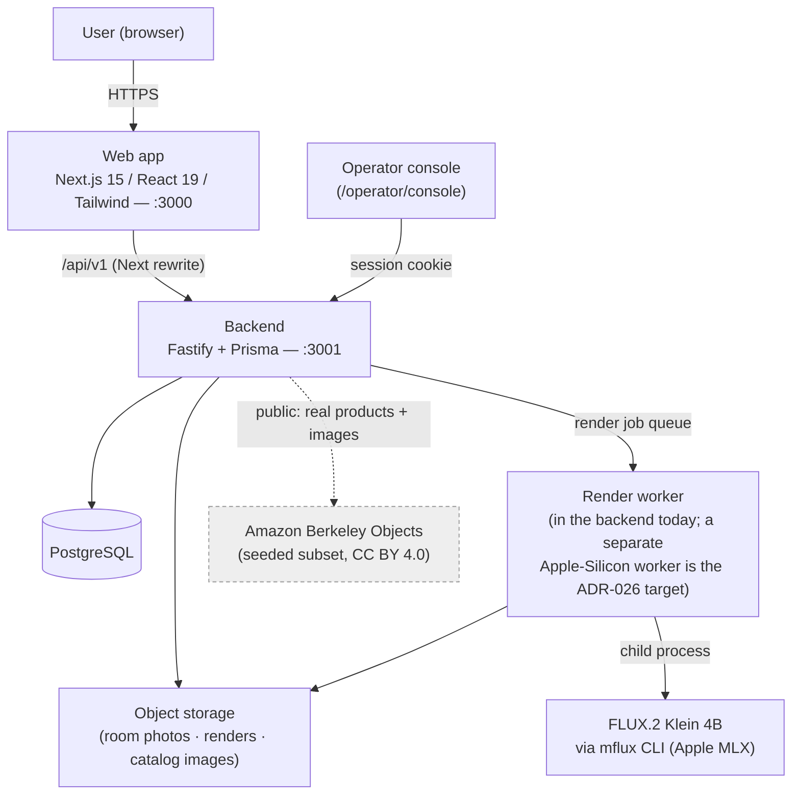
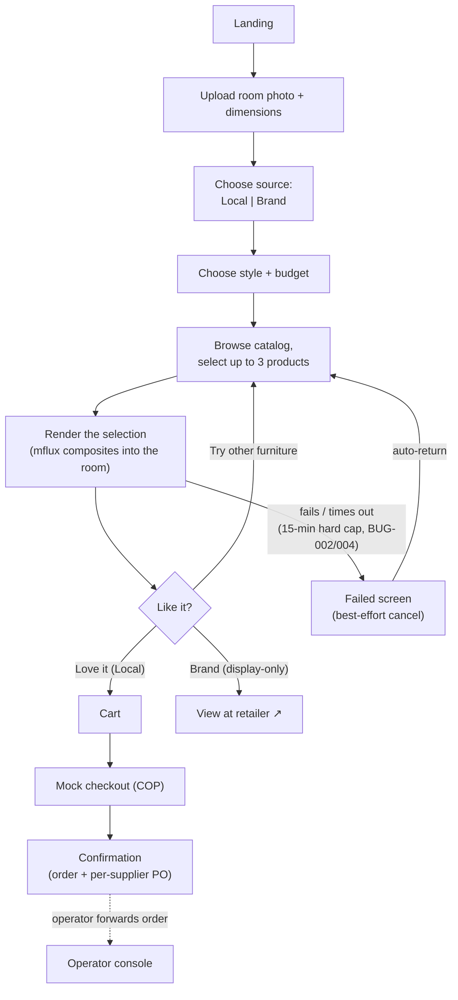
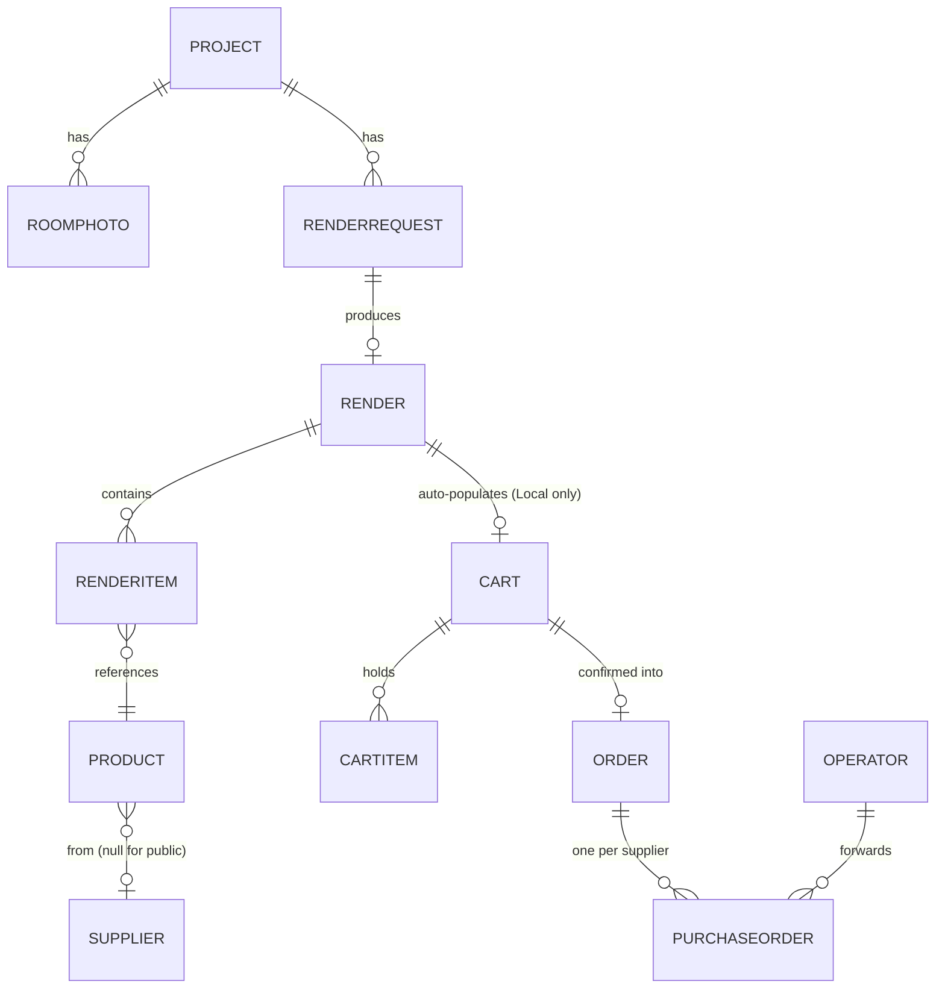

# Spazio — System Overview

> **Read this first.** A single-glance map of what Spazio is, how it is built, and how it flows. It reflects the **current, as-built system** (verified against the code, 2026-07-15; re-verified 2026-07-16 after the BUG-002..005 render-robustness fixes — hard 15-min render cap, serialized render jobs, failed-render flow). Deeper detail lives in the numbered docs (`01`–`13`), the decisions (`decisions/ADR-*`), and the feature specs (`features/FEAT-*`).

## What Spazio is

Spazio lets someone **photograph their room, pick a style, browse real furniture, choose up to three pieces, and see them rendered into their own room** — then buy the ones that are for sale. The AI never invents furniture: every rendered item maps to a real catalog product.

## Current status (honest)

- **Built and verified on a local stack** (web app + backend). It runs end-to-end locally.
- **Not deployed / not released** — there is no `vX.Y.Z` release; it runs on a developer machine only.
- **Class-demo scope.** Three limitations are **deliberately accepted for the demo** and are *not* pending work (see **ADR-029**):
  1. Local-supplier products use **placeholder images** → their renders are generic. (The **Brand** source has real photos.)
  2. Checkout is a **mock** payment gateway (`ADR-003` open).
  3. **No deployment**; the render engine needs an Apple-Silicon host.

## Architecture — tech stack & infrastructure

| Layer | Technology | Notes |
|---|---|---|
| Web app (client) | **Next.js 15** (App Router), **React 19**, **TypeScript**, **Tailwind 3.4** | Runs on `:3000`; device-token client (`x-device-token`), no user accounts (ADR-022); proxies `/api/v1` to the backend |
| Backend (API) | **Node 22**, **Fastify**, **Prisma** | Runs on `:3001`; device-scoped client routes + operator console/session auth |
| Database | **PostgreSQL** (via Prisma) | Local Docker container in dev |
| Object storage | Local-disk `ObjectStorage` | Room photos, renders, catalog images; private by default (NFR-007) |
| Render engine | **self-hosted FLUX.2 Klein 4B via the `mflux` CLI** (Apple MLX) | ADR-026; `RENDER_ENGINE=mflux` for real renders (default `fake` = placeholder); inputs downscaled + EXIF-oriented (BUG-001) |
| Render orchestration | In-process job queue + child-process render worker | Renders publish immediately — no operator review (ADR-025) |

*Deployment reality (ADR-029):* everything above runs on **one local Apple-Silicon machine** today; nothing is hosted.

## Main features

- **Room capture** — upload a real room photo (large phone photos are downscaled + orientation-corrected) plus rough dimensions. (FEAT-002)
- **Source choice** — **Local suppliers** (purchasable) or **Brand suppliers** (real products from a public dataset, display-only). (FEAT-018 / ADR-027)
- **Style & budget** — pick a predefined style (+ free text) and a COP budget. (FEAT-003)
- **Browse & select** — browse the real catalog filtered by source + style and **select up to 3 products** (the cap matches the render engine's ~2–3 reference-image limit). (FEAT-018 / ADR-028)
- **AI render** — composite the selected products into the room photo with the self-hosted engine; published immediately, no review. (FEAT-005 / ADR-026 / ADR-025)
- **Iterate** — "try other furniture" re-renders with the same photo/source/style.
- **Shoppable tags** — each rendered product is tagged; Brand items link out to the retailer. (FEAT-007)
- **Cart & mock checkout** — Local products go to a cart and a mock COP checkout with a per-supplier purchase order; Brand products are display-only. (FEAT-008 / FEAT-010 / ADR-027)
- **Operator console** — catalog curation and manual order forwarding (no render review). (FEAT-015 / FEAT-011)

## App flow

## Product sources

| | **Local suppliers** (`source=supplier`) | **Brand suppliers** (`source=public`) |
|---|---|---|
| Origin | Seeded Bogotá suppliers | Amazon Berkeley Objects dataset (CC BY 4.0) |
| Images | **Placeholder SVGs** → generic render *(ADR-029)* | **Real product photos** → composited for real |
| Purchasable? | **Yes** — cart + mock checkout | **No** — display-only, "View at retailer" link |
| In render-to-purchase metric? | Yes | No (excluded, NFR-006) |
| Governed by | Core thesis (BR-6/BR-14/FR-016) | ADR-027 (labeled, non-purchasable, attributed) |

## Data model (core loop)

Product provenance: `Product.source` is `supplier | public`; public products carry attribution fields (`sourceName`, `sourceUrl`, `sourceImageUrl`, `imageLicense`) and are excluded from cart/checkout. Renders publish on generation success — the `Render` review states and reviewer role were removed (ADR-025/FEAT-016). Full field-level detail: `07_data_model.md`.

## Key decisions (what shaped the system)

| ADR | Decision |
|---|---|
| ADR-024 | Product is the **web app**; no native iOS |
| ADR-025 | **No operator render-review**; renders publish immediately |
| ADR-026 | Render engine = **self-hosted FLUX.2 Klein 4B via mflux** (supersedes ADR-002's hosted-API clause) |
| ADR-027 | **Public-catalog (Brand) fallback** — display-only, attributed, "View at retailer" |
| ADR-028 | **User-curated browse & select** (≤3), inverting the AI-auto-furnish flow |
| ADR-029 | **Demo-scope: the three limitations above are accepted, not pending** |
| ADR-003 | Payment vendor — **open** (checkout is mock) |

Full index: `docs_en/decisions/`.

## How to run

See the root `README.md` (full-stack quick run) and `backend/README.md` / `web-demo/README.md`. In short: start Postgres + the backend on `:3001` (set `RENDER_ENGINE=mflux` with mflux installed for **real** renders; the default `fake` shows a placeholder), then the web app on `:3000`.

## Known limitations (demo scope — ADR-029)

- **Local-supplier renders are generic** (placeholder images); use the **Brand** source for the real-furniture demo.
- **Payments are mock** (`ADR-003` open) — no money moves.
- **Not deployed** — local-only; the render engine needs an Apple-Silicon host.

## Document map

`01` vision · `02` architecture · `03` requirements · `04` non-functional · `05` backlog · `06` API · `07` data model · `08` test plan · `09` AI usage · `10` release notes · `11` implementation flow · `12` pilot build plan (historical) · `13` class-demo scope · `decisions/ADR-*` · `features/FEAT-*`.
